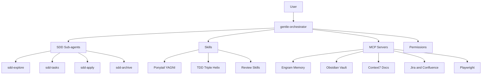
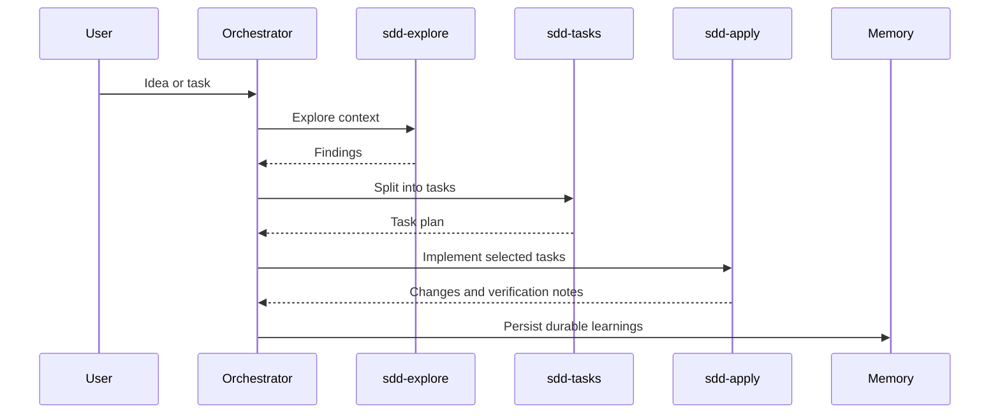

# Gentle AI Architecture Map

The system is a thin OpenCode orchestrator plus specialized sub-agents, skills, MCP tools, and memory layers. The bootstrap now detects platform capabilities and available models instead of assuming one fixed machine profile.

## High-Level Map

## Agents And Models

| Layer | Agent | Default Model | Role |
|---|---|---|---|
| Orchestration | `gentle-orchestrator` | `opencode/deepseek-v4-flash-free` | Coordinate and delegate inside the primary OpenCode runtime |
| Exploration | `sdd-explore` | `ollama/gemma4:31b` | Investigate ideas and code context |
| Proposal | `sdd-propose` | `opencode-go/glm-5.2` | Draft scoped change proposals |
| Design | `sdd-design` | `openai/gpt-5.6-luna` | Handle architecture and tradeoffs |
| Specification | `sdd-spec` | `opencode-go/qwen3.7-plus` | Write structured requirements |
| Task planning | `sdd-tasks` | `ollama/gemma4:31b` | Break work into implementation tasks |
| Implementation | `sdd-apply` | `opencode-go/deepseek-v4-pro` | Apply code changes |
| Verification | `sdd-verify` | `opencode-go/deepseek-v4-pro` | Validate implementation evidence |
| Archive | `sdd-archive` | `ollama/qwen2.5-coder:14b` | Archive completed work |
| Risk review | `review-risk` | `openai/gpt-5.6-tierra` | Security and privilege-boundary review |
| Adversarial judge | `jd-judge-a` | `openai/gpt-5.6-tierra` | Critical judgment-day review |

## SDD Flow

## MCP Surface

| MCP | Status In Template | Purpose |
|---|---|---|
| `context7` | Enabled | Current docs for libraries/frameworks |
| `engram` | Enabled | Persistent memory |
| `playwright` | Enabled | Browser automation/testing |
| `headroom` | Enabled only when installed | Compression and retrieval MCP |
| `obsidian` | Enabled when vault path is configured | Filesystem vault access |
| `obsidian-semantic` | Enabled when token is configured | Semantic vault access |
| `jira` | Enabled when credentials are configured | Jira/Confluence integration |

## Runtime Policy

- OpenCode is the primary installed/runtime target for the shared workspace.
- Claude Code is optional and can be installed as a secondary local agent for users who want both tools.
- The bootstrap does not try to make Claude Code drive the OpenCode workspace config; it only installs it as an extra tool on the machine.

## Governance Layers

| Layer | Rule |
|---|---|
| Ponytail | Keep the smallest correct solution; avoid speculative abstractions |
| TDD Triple Helix | Tests first for non-trivial code work |
| Data Quality Shield | Strong data invariants for ETL/data work |
| Memory | Save durable decisions, discoveries, and fixes |
| MCP minimization | Expose only the tool surface needed |
| Secrets hygiene | Use `.env`, never hardcode credentials |
